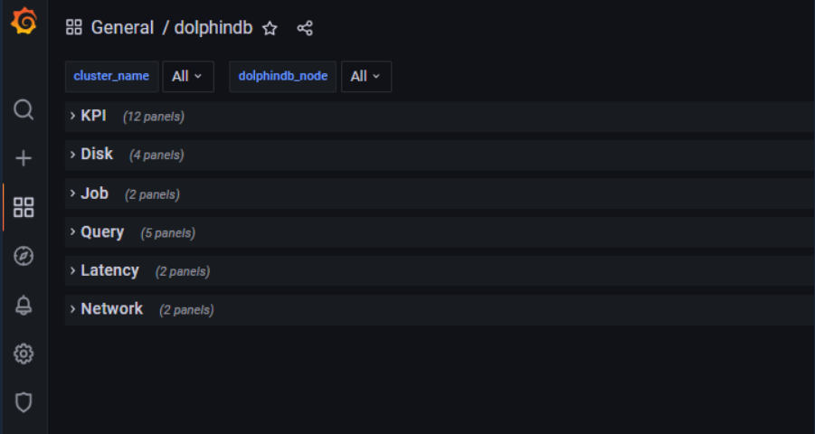
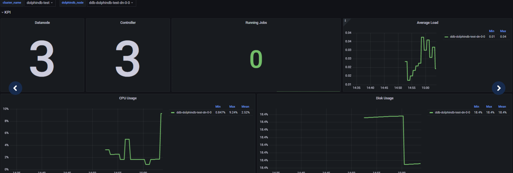
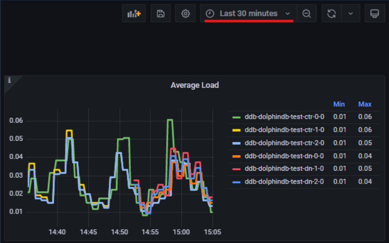

# 基于 K8S 的 DolphinDB 监控告警教程

本文介绍如何对通过 DolphinDB 套件部署的 DolphinDB 集群进行监控及配置告警。

<!-- TOC -->

- [基于 K8S 的 DolphinDB 监控告警教程](#基于-k8s-的-dolphindb-监控告警教程)
  - [1. DolphinDB 集群监控](#1-dolphindb-集群监控)
    - [1.1 持久化监控数据](#11-持久化监控数据)
    - [1.2 访问 Grafana 监控面板](#12-访问-grafana-监控面板)

## 1. DolphinDB 集群监控

用户可以通过 Prometheus 和 Grafana 监控 DolphinDB 集群。支持在创建新的 DolphinDB 集群时，对每个 DolphinDB 集群创建并配置一套独立的监控系统（包括 Prometheus 和 Grafana 组件）。它们需与 DolphinDB 集群运行在同一个 Namespace。

更多监控指标描述，详见 [DolphinDB 集群监控](https://gitee.com/dolphindb/Tutorials_CN/blob/master/DolphinDB_monitor.md)。

对于 v1.0.1 及更高版本的 DolphinDB 套件，通过部署其 Helm 包以快速建立对 Kubernates 上的 DolphinDB 集群的监控。

### 1.1 持久化监控数据

部署 DolphinDB 套件时，设置 global.storageClass 为当前集群中已有的支持数据持久化的存储，否则可能存在数据丢失的风险。
通过以下命令来确认 PVC 情况：
```
$ kubectl get pvc -l app=prometheus -ndolphindb
```
```
NAME                              STATUS   VOLUME                                     CAPACITY   ACCESS MODES   STORAGECLASS   AGE
dolphindb-mgr-prometheus-server   Bound    pvc-e9a66d41-ee0d-4d72-a76e-87aeb7f4399b   8Gi        RWO            local-path     10d
```

### 1.2 访问 Grafana 监控面板

**配置 Grafana**
  
Grafana 是一个通用的指标分析和可视化工具。我们将 Prometheus 采集到的监控指标作为 Grafana 的数据源，通过 Grafana 构建 Dashboard 的方式实现 DolphinDB 监控数据的可视化。

Grafana 以服务的方式来提供应用功能。使用 Helm 部署 dolphindb-mgr 套件时，需要将 service.type 设为 NodePort，以便能在集群外访问 Grafana。
```
helm -n dolphindb install dolphindb-mgr ./dolphindb-mgr --set grafana.service.type=NodePort prometheus.server.service.type=NodePort --create-namespace
```
参数说明如下：
- service.type: grafana 和 prometheus 的将服务开放给外部网络的类型。可设置为 NodePort 或者 LoadBalancer。

NodePort：表示在所有节点上开放一个特定端口，任何发送到该端口的流量都被转发到对应服务。
LoadBalancer：表示在 NodePort 的基础上，借助 cloud provider 创建一个外部的负载均衡器，并将请求转发到 :NodePort，此模式只能在云服务器上使用。
```
kubectl get svc -ndolphindb
```
```
NAME                                    TYPE        CLUSTER-IP       EXTERNAL-IP   PORT(S)          AGE
dockerdolphindb-mgr-grafana             NodePort    10.221.216.221   <none>        80:31019/TCP     8m18s
dockerdolphindb-mgr-prometheus-server   NodePort    10.209.244.24    <none>        80:30574/TCP     8m18s
```
**访问 Grafana**

在浏览器中打开 `http://nodeIP:nodePort`。本文中 `http://localhost:31019` 和 `http://localhost:30574` 分别对应 Grafana 和 Prometheus 的浏览器界面。或通过客户端工具访问这两个地址。Grafana 初始密码为: admin admin，进入 Grafana 后，可以自由修改密码。

**DolphinDB 监控图表说明**

Grafana 仪表盘中通过 27 个 panel 提供了 DolphinDB 27 个运行指标的监控可视化。本文使用 6 行将这 27 个 panel 分为 6 组，如图所示：



 通过选择 `cluster-name` 和 `dolphindb_node` 变量能够得到指定集群和节点的数据。



通过下图的下拉菜单，可以查看不同时间阶段的数据




