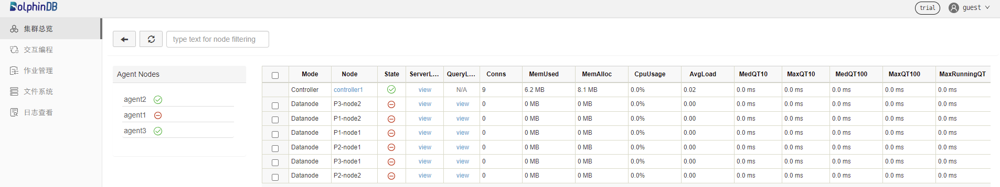

# 基于docker swarm实现多机部署DolphinDB高可用集群

`docker swarm` 是使用 [`SwarmKit` (opens new window)](https://github.com/docker/swarmkit/)构建的 Docker 引擎内置（原生）的集群管理和编排工具。

本文介绍如何通过使用`docker swarm`在多台服务器上实现DolphinDB高可用集群的快速部署。


### 1.环境准备

- **安装 Docker**

docker 可以方便地在 Linux / Mac OS / Windows 平台安装，安装方法请参考 [Docker 官方文档](https://www.docker.com/products/docker)。

- **主机信息**

| 主机名 | IP        | 部署服务                                                    | 数据盘挂载 |
| :----- | :-------- | :---------------------------------------------------------- | :--------- |
| host1  | 10.0.0.81 | docker swarm manager&dolphindb controller1&dolphindb agent1 | /ddbdocker |
| host2  | 10.0.0.82 | docker swarm worker&dolphindb controller2&dolphindb agent2  | /ddbdocker |
| host3  | 10.0.0.83 | docker swarm worker&dolphindb controller3&dolphindb agent3  | /ddbdocker |


### 2. 集群结构介绍

DolphinDB Cluster包括四种类型节点：数据节点（data node），计算节点( compute node ) ，代理节点（agent）和控制节点（controller）。

- 数据节点：用于数据存储。可以在数据节点创建分布式数据库表。
- 计算节点：只用于计算，包括流计算、分布式关联、机器学习等。计算节点不存储数据，故不可在该节点上建库建表，但可以通过 [loadTable](https://gitee.com/link?target=https%3A%2F%2Fdolphindb.cn%2Fcn%2Fhelp%2FFunctionsandCommands%2FFunctionReferences%2Fl%2FloadTable.html) 加载数据进行计算
- 代理节点：用于关闭或开启数据节点
- 控制节点：用于集群元数据的管理和数据节点间任务的协调。

> 注意：
>
> 1.集群中任意一个数据节点或计算节点都可以作为客户端，进行数据读取，但是控制节点仅用于内部管理协调，不能作为任务的主入口；
>
> 2.节点的IP地址需要使用内网IP。如果使用外网地址，不能保证节点间网络通信性能。在docker 容器之间为了保证通讯，一般要提前设置虚拟网桥并分配虚拟ip地址；
>
> 3.每个物理节点必须要有一个代理节点，用于启动和关闭该物理节点上的一个或多个数据节点；
>
> 4.DolphinDB每个集群（非高可用集群）有且仅有一个控制节点。


### 3. 部署方法

#### 3.1 初始化`docker swarm`集群、创建网络

- 在host1这台主机上分别执行如下命令初始化为docker管理节点，

  host1：

  ```shell
  $ docker swarm init --advertise-addr 10.0.0.81
  ```

  预期输出：

  ```shell
  Swarm initialized: current node (rjlg06mt7cll5v2un7mm9f5c1) is now a manager.
  
  To add a worker to this swarm, run the following command:
  
      docker swarm join --token SWMTKN-1-02z7bjebbcd8hw2v48hydu8tbzgffn2co24f89737yeuat6eyt-bkxwe6uhhe6h3z7dlb4q770f5 10.0.0.81:2377
  
  To add a manager to this swarm, run 'docker swarm join-token manager' and follow the instructions.
  ```

  > 注：
  >
  > 1.由于一台主机可能存在多个ip地址，因此在初始化节点时最好带上该主机上指定的ip地址；
  >
  > 2.初始化后，要记下生成的token和端口号等，用于在之后初始化该管理节点的工作节点；
  >
  > 3.一个docker swarm集群只能有一个管理节点，每一个工作节点只能对应一个管理节点

- 在host2、host3上分别执行如下命令，分别向初始化后的管理节点添加工作节点，

  ```shell
  $ docker swarm join --token SWMTKN-1-02z7bjebbcd8hw2v48hydu8tbzgffn2co24f89737yeuat6eyt-bkxwe6uhhe6h3z7dlb4q770f5 10.0.0.81:2377	
  ```

​		预期输出（分别）：

```
This node joined a swarm as a worker.
```

- 在管理节点host1上执行如下命令创建名为ddb_overlay的网络

  ```shell
  $ docker network create -d overlay --subnet 10.5.0.0/16 --attachable ddb_overlay
  ```

  - 参数解释：
    - -d：指docker网络的驱动模式，此处为overlay，是dockers swarm集群所特有的，允许集群之间的服务相互通信
    - --subnet：指设置的网络的子网网段
    - --attachable：指允许单个容器使用该网络进行连接，默认的overlay网络只能允许服务进行连接（必填）
    - ddb_overlay：指创建的网络的名称。此处为ddb_overlay

  预期输出（为网络id）：

  ```
  izlsuymrudiyuojnrtrvq8tdr
  ```

  执行如下命令查看网路情况：

  ```shell
  $ docker network ls
  ```

  预期输出：

  ```
  NETWORK ID     NAME                    DRIVER    SCOPE
  b1caeb0ba5bf   bridge                  bridge    local
  izlsuymrudiy   ddb_overlay             overlay   swarm
  b164bd5280de   ddbdocker_ddb_overlay   bridge    local
  924bdefd3cd9   docker_gwbridge         bridge    local
  7d5c30ab7071   host                    host      local
  nevkh5gqhryb   ingress                 overlay   swarm
  ```

  若ddb_overlay出现在其中，则说明网络创建成功，可以正常使用
  
  > 注意：设置参数为

#### 3.2 创建dolphindb高可用集群

- 登录三台机器，分别执行如下命令拉取完整项目：

  ```shell
  $ git clone https://dolphindb.net/dolphindb/dolphindb_k8s
  ```

- 进入项目目录，在三台机器上分别执行如下命令查看项目目录

  ```shell
  $ tree ./
  ```

  预期输出（每台机器）：

  ```
  ./
  ├── cfg
  │   ├── agent.cfg
  │   ├── cluster.cfg
  │   ├── cluster.nodes
  │   └── controller.cfg
  ├── cluster
  │   ├── agent
  │   │   ├── data
  │   │   └── log
  │   └── controller
  │       ├── data
  │       └── log
  └── dolphindb.lic
  
  8 directories, 5 files
  ```

  文件说明如下：

  | 文件（夹）名  | 文件（夹）说明                                               | 宿主机映射路径（绝对路径）                                   | 容器映射路径（绝对路径）                                     |
  | ------------- | ------------------------------------------------------------ | ------------------------------------------------------------ | ------------------------------------------------------------ |
  | dolphindb.lic | DolphinDB企业版的证书文件，由于DolphinDB社区版镜像构建的容器证书文件无法支持高可用集群服务，需要通过文件映射的方式将容器中的证书文件替换为企业版的 | /ddbdocker/dolphindb.lic                                     | /data/ddb/server/dolphindb.lic                               |
  | cfg           | 用于存储DolphinDB集群各控制节点、代理节点和数据节点的相关配置文件 | /ddbdocker/cfg/agent.cfg; /ddbdocker/cfg/cluster.cfg; /ddbdocker/cfg/cluster.nodes; /ddbdocker/cfg/controller.cfg | /data/ddb/server/clusterDemo/config/agent.cfg; /data/ddb/server/clusterDemo/config/cluster.cfg; /data/ddb/server/clusterDemo/config/cluster.nodes; /data/ddb/server/clusterDemo/config/controller.cfg |
  | cluster       | 用于存储各容器所部署的DolphinDB的数据和日志内容              | /ddbdocker/cluster/controller/data; /ddbdocker/cluster/controller/log; /ddbdocker/cluster/agent/data; /ddbdocker/cluster/agent/log | /data/ddb/server/clusterDemo/data; /data/ddb/server/clusterDemo/log |

​		所对应部署的集群服务的各节点及其容器信息如下

| 容器名称（唯一） | 部署服务类型      | 容器ip   | 对应节点名称、类型、端口                                     |
| ---------------- | ----------------- | -------- | ------------------------------------------------------------ |
| ddb_controller1  | 控制节点          | 10.5.0.2 | controller1,controller,8901                                  |
| ddb_controller2  | 控制节点          | 10.5.0.3 | controller2,controller,8902                                  |
| ddb_controller3  | 控制节点          | 10.5.0.4 | controller3,controller,8903                                  |
| ddb_agent1       | 代理节点&数据节点 | 10.5.0.5 | agent1,agent,8710<br/>P1-node1,datanode,8711<br/>P1-node2,datanode,8712 |
| ddb_agent2       | 代理节点&数据节点 | 10.5.0.6 | agent2,agent,8810<br/>P2-node1,datanode,8811<br/>P2-node2,datanode,8812 |
| ddb_agent3       | 代理节点&数据节点 | 10.5.0.7 | agent3,agent,8910<br/>P3-node1,datanode,8911<br/>P3-node2,datanode,8912 |

> 注：
>
> 1.由于在文件映射过程中宿主机文件目录会始终覆盖对应容器的内容，因此在创建容器时要保证data、log目录下为空以及相关配置文件内容；
>
> 2.容器ip是基于ddb)overlay的，用于容器间通信，要与外部宿主机ip进行区分

- 执行如下命令在三台机器上拉取dolphindb镜像，此处为dolphindb:v2.00.5社区版本的为例（如果机器上没有dolphindb镜像）

  ```shell
  $ docker pull dolphindb/dolphindb:v2.00.5
  ```

- 在三台机器上执行如下命令在各主机上分别创建一个控制节点和一个具有三个数据节点的代理节点：

  - host1:

  ```shell
  $ docker run -itd --name ddb_controller1 --network ddb_overlay --ip 10.5.0.2 -p 8901:8901 \
    -v /ddbdocker/dolphindb.lic:/data/ddb/server/dolphindb.lic \
    -v /ddbdocker/cfg/controller.cfg:/data/ddb/server/clusterDemo/config/controller.cfg \
    -v /ddbdocker/cfg/cluster.cfg:/data/ddb/server/clusterDemo/config/cluster.cfg \
    -v /ddbdocker/cfg/cluster.nodes:/data/ddb/server/clusterDemo/config/cluster.nodes \
    -v /ddbdocker/cluster/controller/data:/data/ddb/server/clusterDemo/data \
    -v /ddbdocker/cluster/controller/log:/data/ddb/server/clusterDemo/log \
    --entrypoint sh \
    dolphindb/dolphindb:v2.00.5 \
    -c 'cd /data/ddb/server;./dolphindb -console 0 -mode controller -home clusterDemo/data -script dolphindb.dos -config clusterDemo/config/controller.cfg -logFile clusterDemo/log/controller.log -nodesFile clusterDemo/config/cluster.nodes -clusterConfig clusterDemo/config/cluster.cfg'
  $ docker run -itd --name ddb_agent1 --network ddb_overlay --ip 10.5.0.5 -p 8710:8710 -p 8711:8711 -p 8712:8712 \
    -v /ddbdocker/dolphindb.lic:/data/ddb/server/dolphindb.lic \
    -v /ddbdocker/cfg/agent.cfg:/data/ddb/server/clusterDemo/config/agent.cfg \
    -v /ddbdocker/cluster/agent/data:/data/ddb/server/clusterDemo/data \
    -v /ddbdocker/cluster/agent/log:/data/ddb/server/clusterDemo/log \
    --entrypoint sh \
    dolphindb/dolphindb:v2.00.5 \
    -c 'cd /data/ddb/server;./dolphindb -console 0 -mode agent -home clusterDemo/data -script dolphindb.dos -config clusterDemo/config/agent.cfg -logFile clusterDemo/log/agent.log'
  ```

  - host2:

  ```shell
  $ docker run -itd --name ddb_controller2 --network ddb_overlay --ip 10.5.0.3 -p 8902:8902 \
    -v /ddbdocker/dolphindb.lic:/data/ddb/server/dolphindb.lic \
    -v /ddbdocker/cfg/controller.cfg:/data/ddb/server/clusterDemo/config/controller.cfg \
    -v /ddbdocker/cfg/cluster.cfg:/data/ddb/server/clusterDemo/config/cluster.cfg \
    -v /ddbdocker/cfg/cluster.nodes:/data/ddb/server/clusterDemo/config/cluster.nodes \
    -v /ddbdocker/cluster/controller/data:/data/ddb/server/clusterDemo/data \
    -v /ddbdocker/cluster/controller/log:/data/ddb/server/clusterDemo/log \
    --entrypoint sh \
    dolphindb/dolphindb:v2.00.5 \
    -c 'cd /data/ddb/server;./dolphindb -console 0 -mode controller -home clusterDemo/data -script dolphindb.dos -config clusterDemo/config/controller.cfg -logFile clusterDemo/log/controller.log -nodesFile clusterDemo/config/cluster.nodes -clusterConfig clusterDemo/config/cluster.cfg'
  $ docker run -itd --name ddb_agent2 --network ddb_overlay --ip 10.5.0.6 -p 8810:8810 -p 8811:8811 -p 8812:8812 \
    -v /ddbdocker/dolphindb.lic:/data/ddb/server/dolphindb.lic \
    -v /ddbdocker/cfg/agent.cfg:/data/ddb/server/clusterDemo/config/agent.cfg \
    -v /ddbdocker/cluster/agent/data:/data/ddb/server/clusterDemo/data \
    -v /ddbdocker/cluster/agent/log:/data/ddb/server/clusterDemo/log \
    --entrypoint sh \
    dolphindb/dolphindb:v2.00.5 \
    -c 'cd /data/ddb/server;./dolphindb -console 0 -mode agent -home clusterDemo/data -script dolphindb.dos -config clusterDemo/config/agent.cfg -logFile clusterDemo/log/agent.log'
  ```

  - host3:

  ```shell
  $ docker run -itd --name ddb_controller3 --network ddb_overlay --ip 10.5.0.4 -p 8903:8903 \
    -v /ddbdocker/dolphindb.lic:/data/ddb/server/dolphindb.lic \
    -v /ddbdocker/cfg/controller.cfg:/data/ddb/server/clusterDemo/config/controller.cfg \
    -v /ddbdocker/cfg/cluster.cfg:/data/ddb/server/clusterDemo/config/cluster.cfg \
    -v /ddbdocker/cfg/cluster.nodes:/data/ddb/server/clusterDemo/config/cluster.nodes \
    -v /ddbdocker/cluster/controller/data:/data/ddb/server/clusterDemo/data \
    -v /ddbdocker/cluster/controller/log:/data/ddb/server/clusterDemo/log \
    --entrypoint sh \
    dolphindb/dolphindb:v2.00.5 \
    sh -c 'cd /data/ddb/server;./dolphindb -console 0 -mode controller -home clusterDemo/data -script dolphindb.dos -config clusterDemo/config/controller.cfg -logFile clusterDemo/log/controller.log -nodesFile clusterDemo/config/cluster.nodes -clusterConfig clusterDemo/config/cluster.cfg'
  $ docker run -itd --name ddb_agent3 --network ddb_overlay --ip 10.5.0.7 -p 8910:8910 -p 8911:8911 -p 8912:8912 \
    -v /ddbdocker/dolphindb.lic:/data/ddb/server/dolphindb.lic \
    -v /ddbdocker/cfg/agent.cfg:/data/ddb/server/clusterDemo/config/agent.cfg \
    -v /ddbdocker/cluster/agent/data:/data/ddb/server/clusterDemo/data \
    -v /ddbdocker/cluster/agent/log:/data/ddb/server/clusterDemo/log \
    --entrypoint sh \
    dolphindb/dolphindb:v2.00.5 \
    -c 'cd /data/ddb/server;./dolphindb -console 0 -mode agent -home clusterDemo/data -script dolphindb.dos -config clusterDemo/config/agent.cfg -logFile clusterDemo/log/agent.log'
  ```

  - 参数解释：
    - --name：指定容器的名称，用来唯一标识一个容器和其它容器进行区分；
    - --network：指定所使用的网络，此处为预先构建好用于在docker swarm集群间不同主机上且允许单个容器加入并通信的网络；
    - --ip：指定容器的ip，要与dolphindb服务所配置的一致；
    - -p：指定映射到宿主机上的容器端口用于宿主机访问容器进程；
    - -v：指定映射到宿主机的文件以便修改和使用；
    - dolphindb/dolphindb:v2.00.5：指定容器所使用的镜像；
    - --entrypoint：指定entrypoint参数覆盖容器内原有的，用于在容器创建时执行的命令，镜像后以-c开头的内容则是执行的具体命令

  预期输出（每条命令）：

  ```shell
  3b5daf381e65fb6acca530c0e7a29d1c418b0aa946d1ab11bcbf66b6fdd405ac
  ```

  若出现容器名称。且通过执行`docker ps`等命令查看docker进程情况确认无误后，说明容器运行正常

- 在三台宿主机之外的另一台机器上，使用浏览器访问任一控制节点所在宿主机ip+对应端口号（此处为10.0.0.81:8901)，结果如下图所示：

  
