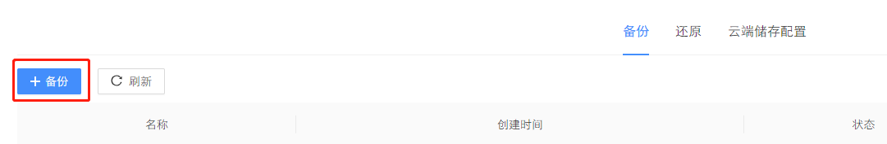
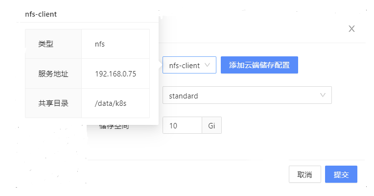
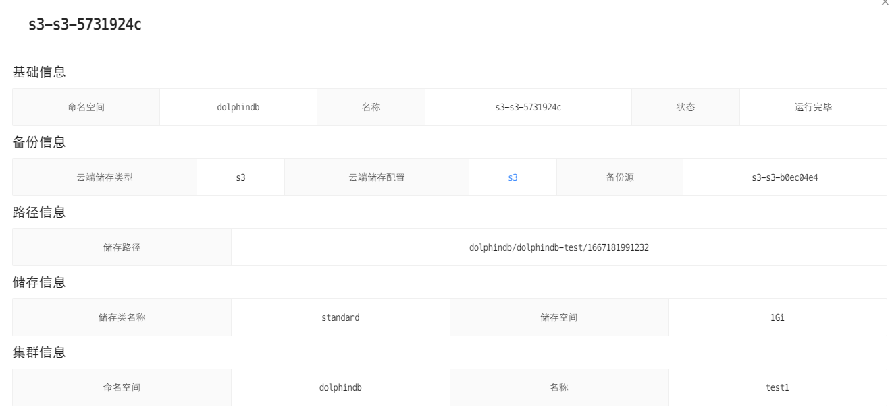
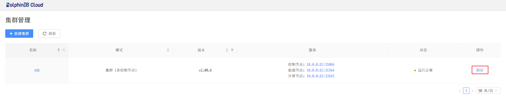

# 如何使用 DolphinDB Cloud Portal

DolphinDB Cloud Portal 提供了可视化 DolphinDB 管理页面，你可以使用这个页面来管理集群。

- [准备工作](#-准备工作)
- [基本使用](#-基本使用)
    - [查看 DolphinDB Cloud Portal 地址](#-查看-dolphindb-cloud-portal-地址)
    - [连接 DolphinDB Cloud Portal](#-连接-dolphindb-cloud-portal)
    - [部署 DolphinDB 集群](#-部署-dolphindb-集群)
        - [点击新建集群](#-点击新建集群)
        - [选择新建集群的配置](#-选择新建集群的配置)
        - [成功部署集群](#-成功部署集群)
        - [连接 DolphinDB 集群](#-连接-dolphindb-集群)
    - [访问 Grafana 面板](#-访问-grafana-面板)
    - [升级 DolphinDB 集群](#-升级-dolphindb-集群)
    - [备份管理](#-备份管理)
        - [备份](#-备份)
        - [还原](#-还原)
        - [云端储存配置](#-云端储存配置)
        - [FAQ](#-faq)
    - [销毁 DolphinDB 集群](#-销毁-dolphindb-集群)
        - [停止 kubectl 的端口转发](#-停止-kubectl-的端口转发)
        - [销毁 DolphinDB 集群](#-销毁-dolphindb-集群)

## 准备工作

- 安装 DolphinDB 套件

## 基本使用

### 查看 DolphinDB Cloud Portal 地址

```sh
$ kubectl -n dolphindb get svc dolphindb-cloud-portal

NAME                     TYPE       CLUSTER-IP     EXTERNAL-IP   PORT(S)          AGE
dolphindb-cloud-portal   NodePort   10.97.218.41   <none>        8080:32480/TCP   9d
```

### 连接 DolphinDB Cloud Portal

通过浏览器访问 http://$IP:$Port 登录 DolphinDB 套件的可视化界面：

参数说明如下：

$IP：Kubernetes 环境中主机 的 ip。

$Port：转发到主机的端口（输出结果中的"32480"）。

### 部署 DolphinDB 集群

#### 点击新建集群


#### 选择新建集群的配置

根据需求选择集群配置，然后点击提交：


> 注意：
>
> 1、控制节点、数据节点、计算节点的 CPU、内存等资源不能超过服务器本身资源，否则集群状态会有异常。
>
> 2、日志模式选择输出到文件性能更佳（推荐）。
>
> 3、标准 pvc 更加灵活，local path 更加简便（推荐，部署文档中的 local-path 是存储类，也是用于提供 pvc 的）。
>
> 4、端口指的是 container 的端口，用在 LoadBalancer 中，指定 port 。

#### 成功部署集群

状态变成`运行正常`，表示集群创建成功，可以正常提供服务。


#### 连接 DolphinDB 集群


> 注意：
>
> 目前 NodePort 服务类型的端口随机分配，不支持指定。

### 访问 Grafana 面板
    
点击`集群监控`，进入 `Grafana` 面板。默认用户名和密码都是 `admin`。


了解更多使用 DolphinDB 套件部署 DolphinDB 集群监控的信息，可以查阅 [DolphinDB 集群监控与告警](./grafana.md)。

### 升级 DolphinDB 集群

DolphinDB 组件可简化 DolphinDB 集群的滚动升级。

执行以下命令，修改 version 字段为 v2.00.8 可将 DolphinDB 集群升级到 v2.00.8 版本：

```sh
$ kubectl patch ddb test -n dolphindb --type merge -p '{"spec": {"version": "v2.00.8"} }'
dolphindb.dolphindb.dolphindb.io/test patched
```

如下图所示，version 变成 v2.00.8 以及 status 变成 Available 状态


> 注意：
>
> 通过 web 升级 DolphinDB 的接口正在开发中。

### 备份管理

当前备份需要基于已有的 ddb 集群进行操作，可以在主页点击已创建集群的名称，进入集群详情页面，再点击`备份管理`按钮，进入备份管理页面


#### 备份

- 点击`备份`，切换到备份管理页面，当前页面 5 秒自动刷新，或者可以点击`刷新`按钮手动刷新。


点击`备份`按钮，新建备份（空数据库不会生成备份文件）



- 在新建备份页面，可以通过下拉框选择云端储存配置，将鼠标放在名称上查看配置的详细信息



- 若下拉框中没有所需的储存配置，可以通过添加云端储存配置按钮来新建储存配置，或者在[云端储存](#云端储存配置)配置页面上新增储存配置


- 选择好储存配置后，选择储存类名称和储存空间(用于储存备份过程中产生的临时文件，在备份完成或者备份删除后回收)。然后点击`提交`。


- 点击备份名称，查看备份详情


- 点击`重新触发`，根据原有配置重新创建备份任务


- 若备份任务失败，可以点击删除，删除备份任务并清理对应的 k8s 资源，同时清理云端储存中的备份文件


#### 还原

- 还原需要基于已有备份进行操作。

1. 点击`还原`


2. 选择需要待还原集群所在的命名空间与名称
3. 点击`提交`，创建还原任务


- 点击`还原`。切换到还原管理页面，查看还原任务的状态，当前页面 5 秒自动刷新，或者可以点击`刷新`按钮手动刷新。


- 点击还原名称，可以查看还原任务详情




- 若还原任务失败，可以点击`删除`按钮，删除还原任务并清理对应的 k8s 资源


#### 云端储存配置

当前支持 NFS 跟 S3 的储存配置，用于将备份文件传输到对应的储存系统中。
第一步，点击`云端储存配置`，切换到储存配置管理页面，当前页面 5 秒自动刷新，或者可以点击`刷新`按钮手动刷新。


第二步，点击`添加云端储存配置`按钮


- 若创建 nfs 储存配置，需要填写名称(若存在相同名称的储存配置，则覆盖原有的配置)，服务地址(部署 nfs 服务的机器 IP)和共享目录(nfs 的挂载目录)，然后点击提交


- 若创建 s3 储存配置，需要填写名称(若存在相同名称的储存配置，则覆盖原有的配置)，供应商，区域(桶所在的区域，如 cn-north-1，可为空)，访问密钥，加密密钥和服务地址(s3 服务的访问地址，以 http 开头)，然后点击提交
 


点击储存配置名称，查看配置详情


若配置不可用，可以点击删除按钮，删除该储存配置


#### FAQ

 1. 当从 2.00 版本往 1.30 版本还原时，出现还原失败 ？

- 因为部分 2.00 特性在 1.30 不支持

 2. 删除备份任务的时候，为什么云端的备份文件也没了？

- 当删除备份任务时，会删除对应的云端备份文件以及对应的 k8s 资源

 3. 创建两个备份任务，为什么执行失败了？

- 一个集群同时只能存在一个运行中的备份任务

 4. 怎么创建 aws s3 的云端储存配置？

- 点击`添加云端储存配置`按钮
- 选择储存类型为 s3
- 填写名称
- 选择供应商为 AWS
- 填写将储存备份文件的桶的区域
- 填写访问密钥和加密密钥
- 点击提交

 5. 怎么创建 ceph 或 minio 的云端储存配置？

- 点击`添加云端储存配置`按钮
- 选择储存类型为 s3
- 填写名称
- 选择供应商为 Ceph 或 Minio
- 填写访问密钥、加密密钥以及服务地址（储存服务的服务端地址，须带上访问端口）
- 点击提交

### 销毁 DolphinDB 集群

完成测试后，你可能希望销毁 DolphinDB 集群。

#### 停止 kubectl 的端口转发

如果你仍在运行正在转发端口的 `kubectl` 进程，请终止它们：

```bash
$ pgrep -lfa kubectl
```

#### 销毁 DolphinDB 集群

方式一：通过 Web 管理器删除按钮销毁



方式二：通过命令行进行销毁

```shell
$ kubectl delete ddb $ddbName  -ndolphindb
```

参数说明如下：

- $ddbName：Kubernetes 环境中删除的 DolphinDB 集群名称。