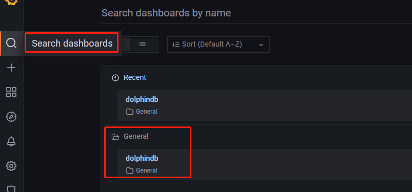
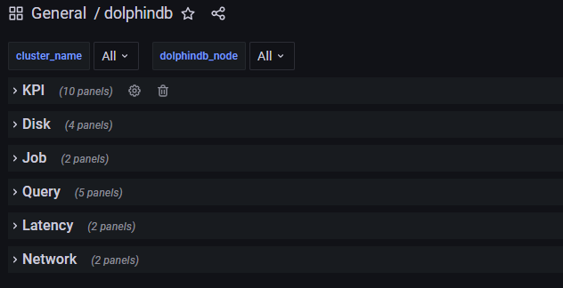
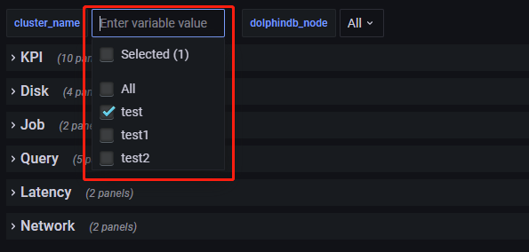
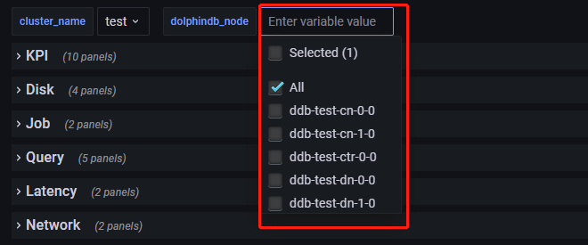

# 如何使用 Grafana

## 概述

Grafana 是一个通用的指标分析和可视化工具。我们将 Prometheus 作为 Grafana 的数据源，通过 Grafana 构建 Dashboard 的来实现 DolphinDB 监控数据的可视化。初始密码为: admin admin，进入Grafana后密码可以自由设置。

## 准备工作

- 安装 DolphinDB 套件并通过套件部署 DolphinDB 集群

## 基本使用

- 点击 `Search dashboards`, 点击预置的 `dolphindb dashboards`，可以查看 `DolphinDB` 的各项数据指标：

  
  
- 通过指定集群和节点，可以仅查看该集群节点的数据指标：

  

  

## 面板说明

| 面板名称  | 含义         |
| ------------------------ | ------------ |
| Running Jobs  | 正在运行的job数量   |
| Average Load  | 平均负载   |
| CPU Usage  | CPU 使用率   |
| Disk Usage  | 磁盘使用率   |
| Memory used  | 可用内存   |
| Memory allocated  | 已分配的内存   |
| Disk read rate  | 磁盘读取速率   |
| Disk write rate  | 磁盘写入速率   |
| Network receive rate  | 网络接收速率   |
| Network send rate  | 网络发送速率   |
| Disk free space  | 可用磁盘空间大小   |
| Disk Capacity  | 总磁盘空间大小   |
| Last minute read volume  | 上一分钟从磁盘读取量   |
| Last minute write volume  | 上一分钟往磁盘写入量   |
| Queued Jobs  | 正在等待队列中的job数量   |
| Job load  | 工作负载（job数量与workers数量的比率）   |
| Max last100 query time  | 至今为止，前100次完成的查询中的最大用时  |
| Max last10 query time  | 至今为止，前10次完成的查询中的最大用时   |
| Med last100 query time  | 至今为止，前100次完成的查询中的平均用时   |
| Med last10 query time  | 至今为止，前10次完成的查询中的平均用时   |
| Max running query time  | 当前正在执行中的查询的最大用时   |
| Last message latency  | 接收上一条消息的延迟   |
| Cum message latency  | 订阅过程中，所接收全部消息的加权平均延时   |
| Last minute network received  | 上一分钟从网络接收量   |
| Last minute network sent  | 上一分钟往网络发送量   |
