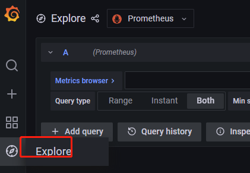
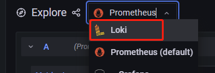

# 如何使用 Loki

## 概述

Loki 是 Grafana Labs 团队最新的开源项目，是一个水平可扩展，高可用性，多租户的日志聚合系统。Loki 只会对你的日志元数据标签（就像 Prometheus 的标签一样）进行索引，而不会对原始的日志数据进行全文索引。然后日志数据本身会被压缩，并以 chunks（块）的形式存储在对象存储（比如 S3 或者 GCS）甚至本地文件系统。

## 准备工作

- 安装 DolphinDB 套件并通过套件部署 DolphinDB 集群
- 确保 DolphinDB 集群的日志模式为输出到文件或者同时输出到文件和标准输出
- 登录 Grafana

## 基本使用

- 切换 grafana 的数据源为 Loki

  点击 `Explore` 跳转到 `Explore` 页面, 切换数据源为 `Loki`：

  
  
  

- 根据需求筛选日志

  点击 `Log browser`, 选择 `label`，然后选择对应的 `value`，点击 `show logs`，查询到指定日志了：

  

## 日志 label

- filename: 需要搜索的日志文件
- job： 日志分类
  - standalone_log：单机节点日志
  - controller_log：控制节点日志
  - node_log：普通节点日志
  - job_log：操作日志
  - output：output 日志
- level：日志等级，ERROR，INFO，DEBUG，WARNING
- pod_name：节点名
- pod_namespace: 节点所在的命名空间