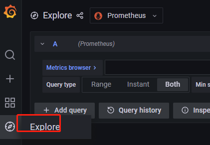
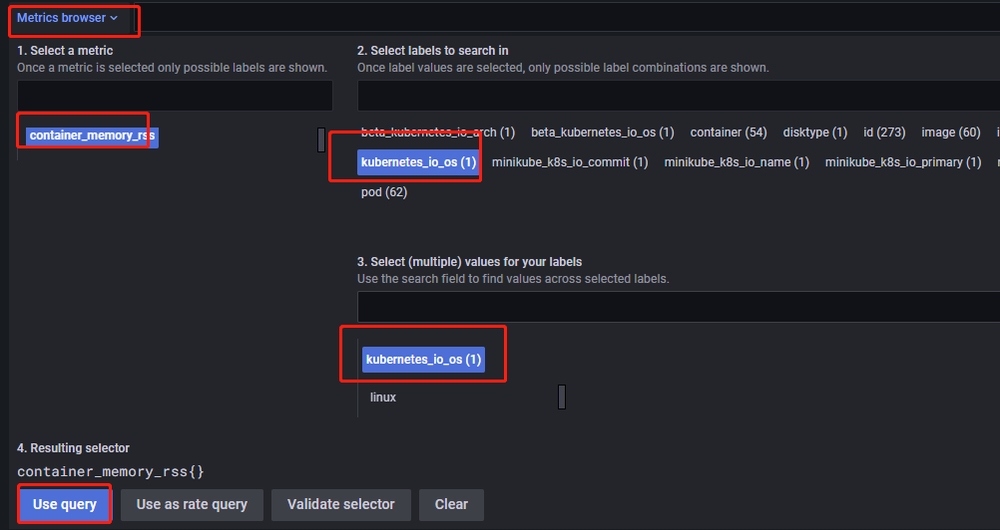

# 如何使用 Prometheus

## 概述

​Prometheus 是以开源软件的形式进行研发的系统监控和告警工具包。

## 准备工作

- 安装 DolphinDB 套件并通过套件部署 DolphinDB 集群
- 登录 Grafana

## 基本使用

- 点击 `Explore` 跳转到 `Explore` 页面：

  

- 根据需求查询数据指标

  点击 `Metrics browser`, 选择 `metric`，再选择 `label`, 然后选择对应的 `value`，点击 `Use query`，查询数据指标：
  
  

## DolphinDB 数据指标

| 指标名称  | 含义         |
| ------------------------ | ------------ |
| dolphindb_metric_running_jobs  | 正在运行的job数量   |
| dolphindb_metric_average_load  | 平均负载   |
| dolphindb_metric_cpu_usage  | CPU 使用率   |
| dolphindb_metric_disk_usage  | 磁盘使用率   |
| dolphindb_metric_memory_used  | 可用内存   |
| dolphindb_metric_memory_alloc  | 已分配的内存   |
| dolphindb_metric_disk_read_rate  | 磁盘读取速率   |
| dolphindb_metric_disk_write_rate  | 磁盘写入速率   |
| dolphindb_metric_network_recv_rate  | 网络接收速率   |
| dolphindb_metric_network_send_rate  | 网络发送速率   |
| dolphindb_metric_disk_free_space  | 可用磁盘空间大小   |
| dolphindb_metric_disk_capacity  | 总磁盘空间大小   |
| dolphindb_metric_last_minute_read_volume  | 上一分钟从磁盘读取量   |
| dolphindb_metric_last_minute_write_volume  | 上一分钟往磁盘写入量   |
| dolphindb_metric_queued Jobs  | 正在等待队列中的job数量   |
| dolphindb_metric_job_load  | 工作负载（job数量与workers数量的比率）   |
| dolphindb_metric_max_last100_query_time  | 至今为止，前100次完成的查询中的最大用时  |
| dolphindb_metric_max_last10_quer_time  | 至今为止，前10次完成的查询中的最大用时   |
| dolphindb_metric_med last100 query_time  | 至今为止，前100次完成的查询中的平均用时   |
| dolphindb_metric_med_last10_query_time  | 至今为止，前10次完成的查询中的平均用时   |
| dolphindb_metric_max_running_query_time  | 当前正在执行中的查询的最大用时   |
| dolphindb_metric_last_msg_latency  | 接收上一条消息的延迟   |
| dolphindb_metric_cum_msg_latency  | 订阅过程中，所接收全部消息的加权平均延时   |
| dolphindb_metric_last minute_network_recv  | 上一分钟从网络接收量   |
| dolphindb_metric_last_minute_network_send  | 上一分钟往网络发送量   |

## DolphinDB 告警规则

| 告警名称  | 告警条件         |
| ------------------------ | ------------ |
| HighCpuUsage  | DolphinDB内存使用率达80%且持续2分钟以上。告警等级：warning    |
| HostOutOfMemory  | DolphinDB所在物理节点可用内存不足10%且持续2分钟以上。告警等级warning   |
| DolphinDBOutofMemory  | DolphinDB分配的内存和配置的最大内存比不足10%且持续2分钟以上。告警等级：warning   |
| OutOfDiskSpace  | DolphinDB datanode空闲磁盘比率不足10%且持续2分钟以上。告警等级：critical   |
| JobRunningException  | 节点运行的Job数量30min内未变化，判断为Job运行异常。告警等级：warning  |
| DolphinDBNodeDown  | DolphinDB 节点宕机超过2分钟。告警等级：critical   |
| HostNodeDown  | DolphinDB所在物理节点宕机超过2分钟。告警等级：critical    |